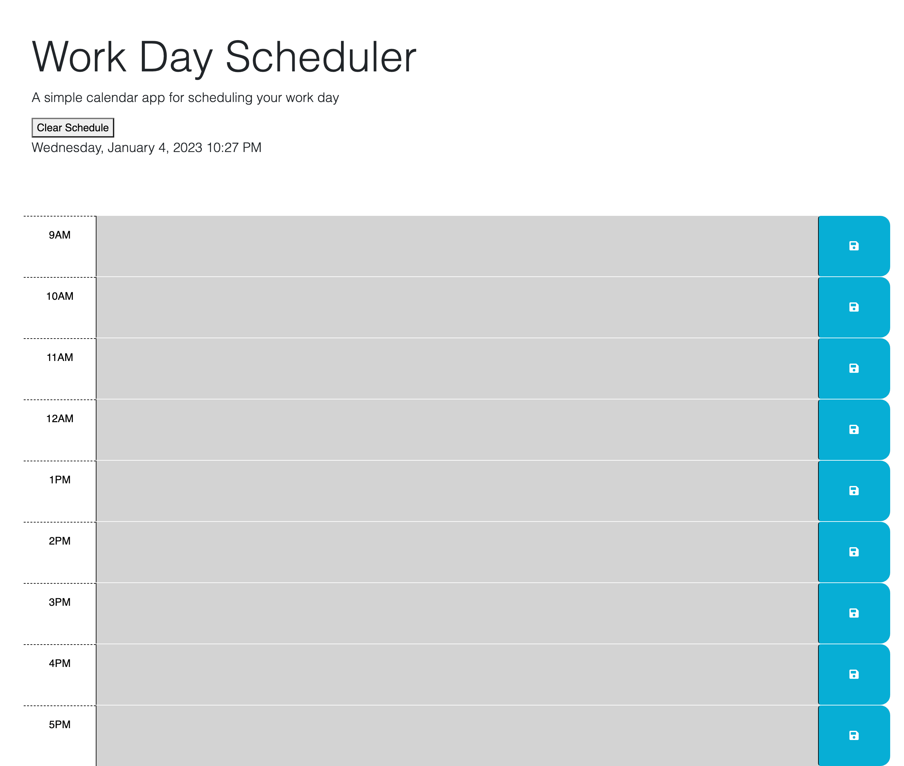

# Module-5-Module : Work Day Scheduler

## Description

I created a simple calendar application that allows a user to save events for each hour of the day by modifying starter code. This app will run in the browser and feature dynamically updated HTML and CSS powered by jQuery. I utilized the [Day.js](https://day.js.org/en/) library to work with date and time. 

## Installation

1. I worked maily in JavaScript and HTML to modify a planner
2. Day.js was utilized to later create a function that makes the time blocks change with the passage of time
3. Information in the planner was saved andf refreshed in the console as well as in the webpage. 

## Screenshot

The following image shows the web application's appearance and functionality:

## Usage

Webpage:

 [Github Page Address](https://github.com/delacruzjonathan/Module-5-Challenge)
